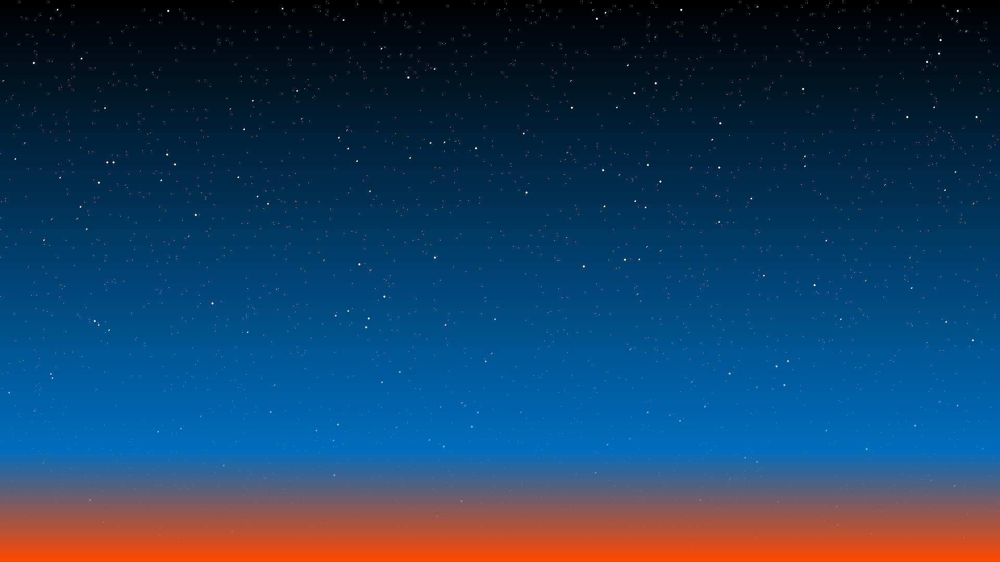

# Twilight

Twilight is a wallpaper program written by Howard Look for SGI's "Irix" computer operating system. This program "looks like the western sky as the	sun sets (or perhaps the eastern sky as	the sun	rises)". The original source code is also provided along with my implementation. Below is a screenshot of both this application and the original on an "Irix" system.

### Program

  

### Original

## Building

#### Dependencies
* SDL2
* make
* C++ compiler, default is gcc

The makefile does require you to configure the library and include directories for SDL2.
